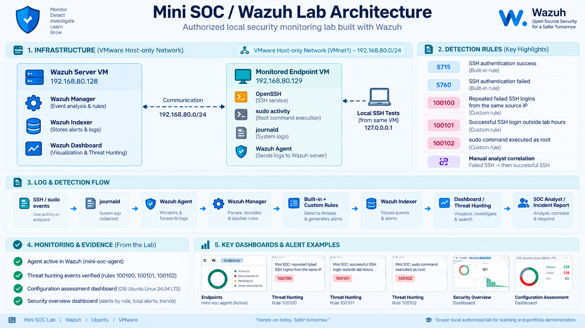

# Mini SOC — Security Monitoring & Threat Detection Lab

**Status (23 September 2026):** Operational **local training lab** with a connected Ubuntu endpoint, three live-tested custom Wazuh detection rules, a saved four-panel SOC dashboard, and an evidence-backed simulated-incident report. This is **not a production SOC or a real intrusion**. Remaining portfolio work: reconcile older scaffold files, index existing evidence and prepare the final public case study.

## Architecture — implemented



*Conceptual architecture illustration (not original forensic evidence).* [Public screenshot gallery](screenshots/README.md).


```text
VMware Host-only lab (VMnet1)
Ubuntu monitored endpoint: mini-soc-agent (192.168.80.129)
    authorized SSH / sudo activity on its own loopback 127.0.0.1
           ↓
    systemd-journald → Wazuh agent 4.14.7
           ↓
Wazuh Manager 4.14.7 (192.168.80.128)
           ↓
Built-in and custom detection rules → Indexer → Dashboard
           ↓
SOC investigation → documented benign-test disposition
```

The central Ubuntu VM runs Wazuh Manager, Indexer and Dashboard. An existing endpoint `journald` collector forwards local SSH and `sudo` logs. The two VMs were moved from VMware NAT to Host-only before bounded repeat-SSH testing; Host-only does not imply complete isolation from the host PC. Windows monitoring, network scan telemetry and production deployment were **not implemented**. [Implementation details and service checks](docs/phase-07-technical-handover.md).

## Verified detections

| Scenario | Detection | What was observed |
| --- | --- | --- |
| Repeated failed SSH login | Custom **100100**, level **10**, five matched failures / 120 s, grouped by source IP | Interactive synthetic match and a bounded, live local SSH test produced a matching Wazuh alert. |
| Failed SSH then successful SSH | Built-in **5760** (failure) and **5715** (success) | Two separate indexed alerts; analyst correlation **manual only**. |
| Successful SSH login outside illustrative lab hours 09:00–18:00 UTC | Custom **100101**, level **10** | Synthetic tests on either side of 18:00 UTC and a real authorized off-hours login produced the expected matches. |
| Successful `sudo` command as root | Custom **100102**, level **5** | A benign authorized `sudo /usr/bin/true` command generated a matching root-level privilege-use alert, **not** proof of malicious escalation. |

[Exact XML fragments, observed tests and limitations](detection-rules/README.md). A test that triggers an alert is not proof of an external attacker, compromised account or actual malicious activity. Time synchronization, false-positive rates and the in-hours SSH negative-control result were not independently verified.

## Saved SOC dashboard

`Mini SOC - Security Overview` uses four visualizations: **Total Alerts**, **Alerts by Rule Level**, **Alerts Over Time** and **Top 10 Alert Rules**. The saved view uses `agent.name:"mini-soc-agent"` and the rolling **Last 7 days** period. At the time of the [public dashboard screenshot](screenshots/P06-01-soc-dashboard.png), it displayed **412 alert documents**, **not 412 attacks**. This time-dependent figure is not a fixed project statistic.

## Reports and evidence

**[View the eight-image public gallery — architecture, Agent, custom rules 100100/100101/100102, and Dashboard](screenshots/README.md).** The live off-hours SSH rule 100101 has two complementary original screenshots ([alert](screenshots/P04-07-off-hours-ssh-live-alert.png) · [matching details](screenshots/P04-07-off-hours-ssh-live-details.png)), which document one authorized test, not two. See the [text evidence index](docs/evidence-index.md) for event-level verification.


- [Technical handover — actual topology, rules, operations and known limitations](docs/phase-07-technical-handover.md)
- [SOC case report — repeated SSH failures, authorized lab](incident-report/ssh-repeated-failures-lab-case.md)
- [Public detection evidence: timestamped logs, rule outcomes and limitations](docs/evidence-index.md)
- [Public SOC report: 23 Sep log observations and benign-test disposition](incident-report/ssh-repeated-failures-lab-case.md)
- [Public dashboard description and observation snapshot](docs/dashboard.md)
- [Public evidence-to-claim index](docs/evidence-index.md)

**Eight image files are committed and linked under [screenshots/](screenshots/README.md):** one conceptual architecture infographic and seven selected Wazuh/Ubuntu views, including two complementary views of the same 100101 live test. Some other original source-log and synthetic-test screenshots are not publicly uploaded; timestamped observations and rule XML are available here without private-workspace access.

## Lab safety and disclosure

Run controlled security tests only on owned, authorized lab systems. Do not expose the SIEM publicly or publish passwords, API tokens, private keys or unrelated identifying data. Local RFC1918 addresses above describe the owned VMware lab, not an outside target. This repository records what was verified, distinguishes built-in from custom rules, and documents what remains untested.
